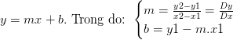

<!-- Banner -->

  

<h1 align="center"><b>ĐỒ HOẠ MÁY TÍNH</b></h>

## THÀNH VIÊN NHÓM
| STT    | MSSV          | Họ và Tên              |Chức Vụ    | Github                                                  | Email                   |
| ------ |:-------------:| ----------------------:|----------:|--------------------------------------------------------:|-------------------------:
| 1      | 19521676      | Đỗ Trọng Khánh         |Nhóm trưởng|[trong-khanh-1109](https://github.com/trong-khanh-1109)  |19521676@gm.uit.edu.vn   |
| 2      | 19521383      | Võ Phạm Duy Đức        |Thành viên |[ducducqn123](https://github.com/ducducqn123)            |19521383@gm.uit.edu.vn   |

## GIỚI THIỆU MÔN HỌC
* **Tên môn học:** Đồ hoạ máy tính
* **Mã môn học:** CS105
* **Mã lớp:** CS105.M11.KHCL
* **Năm học:** HK1 (2021 - 2022)
* **Giảng viên**: ThS.Cáp Phạm Đình Thăng

## QUÁ TRÌNH
### Week 1: Các thuật toán vẽ đường thẳng.
#### 1. Thuật toán Digital differential analyzer (DDA)
  - Phương trình đường thẳng: `y = m.x + b`. 
   
  - Để đơn giản hóa giải thuật ta xét đường thẳng với `min [0,1] , Dx > 0`
  - Tại mỗi bước ta cho `X` tăng lên 1 đơn vị tức là `Xi+1 = Xi + 1 => Yi+1 = Yi + m`
  - Do `m` là số thực nên muốn `Yi+1` là số nguyên ta phải làm tròn trước khi truy xuất tọa độ để đưa ra màn hình.
  - Với đường thẳng có `m > 1` ta sẽ làm ngược lại cho `Y` biến thiên và tính `X` theo `Y` nghĩa là tại mỗi bước ta có Yi+1 = Yi + 1 => Xi+1 = Xi + m
  - Với các đoạn thẳng có `Dx <0` ta sẽ cho `X` giảm xuống chứ không tăng. 

<table>
<tr>
  <td>
    
  </td>
  <td>
    
  </td>
</tr>
<table>
  
  - Code: [DDA Algorithm](Week_1/LineDDA.cpp)
 
#### 2. Thuật toán Bresenham
  - Với thuật toán Bresenham vẽ đường thẳng có thể xác định được điểm cần tìm dựa vào khoảng cách giữa đường thẳng thực tế với các điểm nằm trong vùng lựa chọn.
  - Để vẽ được đường thẳng trên màn hình máy tính cần xác định được điểm ảnh vẽ tiếp theo trên màn hình. Thuật toán Bresenham có thể xác định được điểm cần tìm dựa vào khoảng cách giữa đường thẳng thực tế với các điểm nằm trong vùng lựa chọn.
<table>
<tr>
  <td width>
    
  </td>
  <td>
    
  </td>
</tr>
<table>
  
  - Code: [Bresenham Algorithm](Week_1/LineBresenham.cpp) 
### Week 2: Thuật toán vẽ đường tròn và Các phép biến đổi.

#### 1. Thuật toán Mid-Point.
  - Sử dụng thuật toán Mid-Point để tính toán tất cả các điểm chu vi của vòng tròn trong một cung tròn đầu tiên và sau đó in chúng cùng với các điểm phản chiếu của chúng trong các cung tròn khác. Điều này sẽ hoạt động vì một vòng tròn là đối xứng về tâm của nó.
  <table>
<tr>
  <td width>
    
  </td>
  <td>
    
  </td>
</tr>
<table>
  
- Code: [Mid-Point Algorithm](https://github.com/trong-khanh-1109/CS105.M11.KHCL/blob/2e0ecad4565bcd6d9b33013ad973ba1332a441b5/Week_2/CircleMidPoint.cpp)
  
#### 2. Các phép biển đổi affine cơ sở.
  - Có 3 phép biến đổi affine cơ sở: Phép tịnh tiến, Phép quay, Phép tỉ lệ.
  - Phép tịnh tiến (translation): Dùng để thay đổi vị trí của đối tượng từ vị trí này sáng vị trí khác.
    + Độ dịch chuyển trên trục Ox : tx.
    + Độ dịch chuyển trên trục Oy : ty.
  - Phép quay (rotation): Dùng để thay đổi hướng của đối tượng.
    + Tâm quay : O.
    + Góc quay : alpha.
  - Phép tỉ lệ (scaling): Dùng để thay đổi kích thước của đối tượng.
    + Tâm tỉ lệ : O.
    + Hệ số tỉ lệ : sx, sy.
  - [Công thức và cài đặt](https://github.com/trong-khanh-1109/CS105.M11.KHCL/blob/54c08fb828f6c528f01af235acb269e937e4b6cb/Week_2/lecture_2D_1.pdf)
  
### Week 3: Thuật toán vẽ Ellipse và tô màu.
  - Chia Elip làm 2 phần tại điểm Q nơi có hệ số góc của tiếp tuyến với Elip bằng -1. Tại vùng thứ nhất, x biến thiên nhanh hơn y và tại vùng thứ hai , y biến thiên nhanh hơn x. Nhớ lại công thức hệ số góc của đường cong : `dx/dy = fx/fy = (2b2x) /( 2a2y)` 
    
&emsp;&emsp;&emsp;&emsp; 
  
  - Code: [Mid-Point Algorithm and Boundary Fill & Scan line fill.](https://github.com/trong-khanh-1109/CS105.M11.KHCL/blob/1510740a8d95bda06f005f19205f65dec570f7b7/Week_3/Elip.cpp)
  
<!-- Footer -->

© Copyright by Đỗ Trọng Khánh

